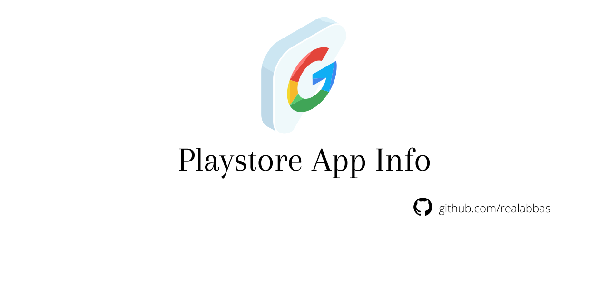

### Playstore App Info



#### Usage

```
const play_app_info = require('playstore-app-info')

play_app_info("com.kakarooms").then(res=>{
    console.log("res", res)
})

```

#### Response Schema

| Property                  | Type    | Value |
|---------------------------|---------|-------|
| id                        | string  |       |
| logo                      | string  | url   |
| app_name                  | string  |       |
| app_url                   | string  | url   |
| category                  | string  |       |
| contains_ads              | boolean |       |
| publisher_account_url     | string  | url   |
| publisher_name            | string  |       |
| preview_images            | array   |       |
| youtube_trailer           | string  | url   |
| description               | string  |       |
| application_meta_data     | object  |       |
| latest_update_description | string  |       |
| ratings_data              | array   |       |

#### Response Data Format (JSON)

```
{
  id: 'com.kakarooms',
  logo: 'https://play-lh.googleusercontent.com/oSPuaaIkM7M-4mfkQJzc1CzaJWep4465CIPft5ObwNI9P-AMNLUNLzD0rQy_ttQLeh9T=s180',
  app_name: 'Mr Room: Search Hostels, PG and Flats 🏃🏻 Easily',
  app_url: 'https://play.google.com/store/apps/details?id=com.kakarooms',
  category: 'House & Home',
  contains_ads: true,
  publisher_account_url: 'https://play.google.com/store/apps/developer?id=MrRoom',
  publisher_name: 'MrRoom',
  preview_images: [
    'https://play-lh.googleusercontent.com/e5Mocy26xhvC8NZyoPr_Tikk1QOWEkLpFXwoR4-mveUmgG_mdOA-Pbk5rjSMxu0dPQ=w720-h310',
    'https://play-lh.googleusercontent.com/upzECkks147uQl1pT4d5ughZrRGtNolVUN3TkCv98RyK-whEoL1hFhJX_9O_edham7rx=w720-h310'
  ],
  youtube_trailer: 'N/A',
  description: "Are you in the hunt for Hostels, PG or Flats and want it without Brokerage fee, then you have landed on the correct way. Do you know, every year 10 million students migrate to a new city and they face the same problem They miss their home and want a comfortable place to live. But what they eventually get after all their efforts are sub-standard rooms and facilities. 😏 Don't worry if you are moving to a new city for education. Because MrRoom is here.😎So what do we do?We help students in searching for affordable rooms close to their desired location. 🤩We have a wide variety of verified hostels and pgs registered on our platform and most importantly, we charge zero brokerage. Our platform offers Filters to customize the Search Results and can check Room Availability from anywhere anytime. We also give tenants 💃 🕺the facilities to manage their monthly rent online. There will be complete transparency between the owners and tenants. So, a standard one-stop solution for students who want to focus more on studies rather than wasting time in finding the necessary facilities. You can search for 100+ rental rooms(Hostels, Pg and Flats) according to your desired choice. 🤟Finding accommodation was never so easy. Just book your room through our app and that too without paying any brokerage fee. So, search and book through our MrRoom No Brokerage app which provides you with hassle-free stay options.",
  application_meta_data: {
    updated: 'September 19, 2020',
    size: '12M',
    installs: '1,000+',
    current_version: '2.1.3',
    requires_android: '4.4 and up',
    content_rating: 'Rated for 3+Learn more',
    permissionsview_details: '',
    reportflag_as_inappropriate: 'N/A',
    offered_by: 'MrRoom',
    developer: {
      app_developer_website: 'https://www.mrroom.in/',
      app_developer_email: 'mailto:mrroomindia@gmail.com',
      app_developer_policy: 'https://www.mrroom.in/policy',
      app_developer_address: 'N/A'
    }
  },
  latest_update_description: 'Better User Interface and User InteractionSocial Authentication AddedCoaching Category AddedMess Category AddedLaundry Category AddedReview System AddedSearch System EnhancedAdd a ListingSubmit RequirementImprove ListingRaise a Ticket Option Added',
  ratings_data: {
    ratings: '4.3',
    ratings_distribution: [ [Object], [Object], [Object], [Object], [Object] ]
  }
}
```
#### NPM Package

You can also use this in form of **npm package** Click here to go to [npm](https://www.npmjs.com/package/playstore-app-info)

#### Dependencies

- JSDOM
- Axios


